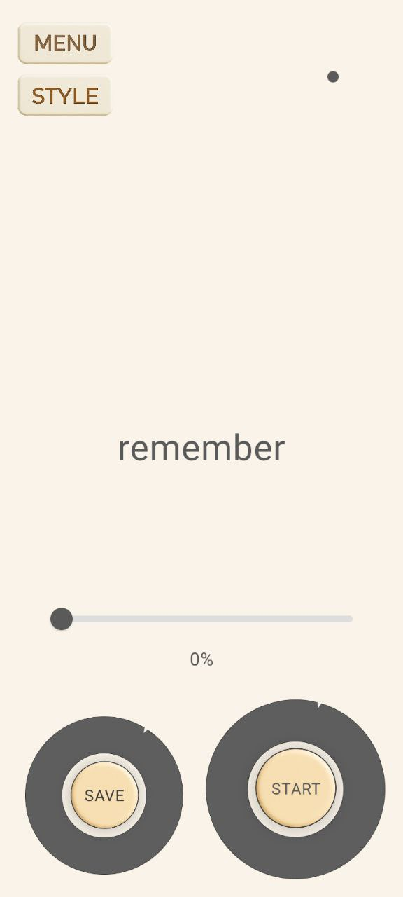
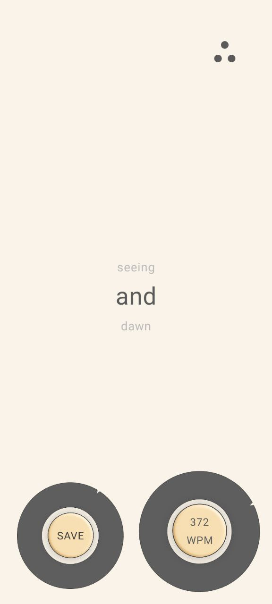

# ReadRush

Android speed reading application built with Kotlin and Jetpack Compose.

## Overview

ReadRush is a product-oriented MVP designed to improve reading speed through dynamic word-by-word playback and real-time speed control.

The application supports TXT, EPUB, and FB2 formats and includes a custom speed control mechanism built specifically for smooth interaction and stable gesture handling.

## Key Features

- Word-by-word dynamic reading
- Custom speed control mechanism
- Real-time speed adjustment
- Support for TXT, EPUB, and FB2 formats
- Bookmark saving
- State-driven UI logic

## Tech Stack

- Kotlin
- Jetpack Compose
- State management
- File parsing
- Navigation architecture

## Technical Challenges Solved

- Implemented a custom gesture-based speed control mechanism
- Resolved interaction conflicts between tap and rotation gestures
- Built a dynamic playback engine with real-time speed updates
- Designed a stable UI architecture for continuous reading flow

 ## 📱 Screenshots

  
  
  

